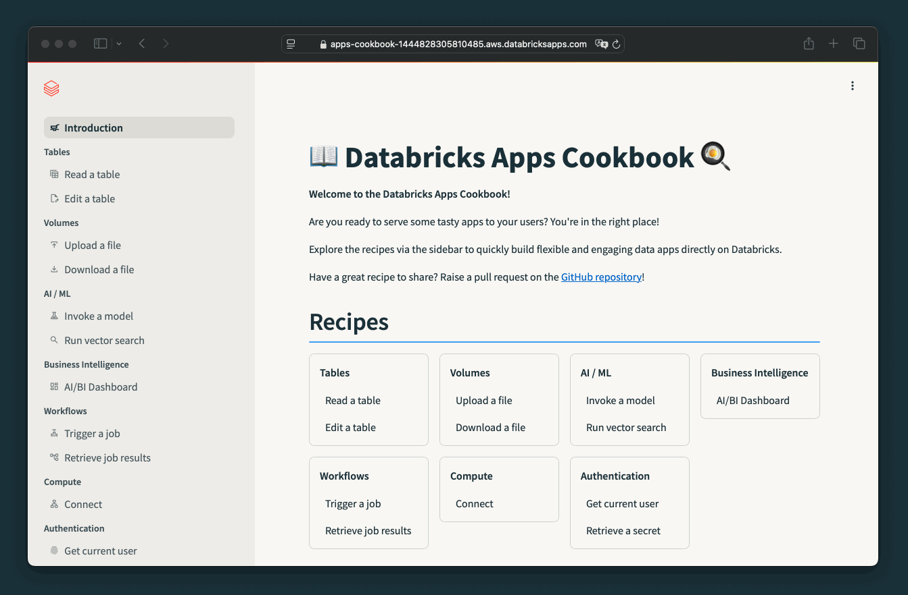

# 📖 Databricks Apps Cookbook 🍳

Ready-to-use code snippets for building **Dash, Streamlit, Reflex, and FastAPI** apps on [Databricks Apps](https://docs.databricks.com/en/dev-tools/databricks-apps/index.html).

Learn more on **[apps-cookbook.dev](https://apps-cookbook.dev/)**. Coding agents: start with **[AGENTS.md](AGENTS.md)** and the path below.

## What is the Databricks Apps Cookbook?

- **10+ recipes for common Apps use cases** such as reading and writing tables and volumes, invoking ML / GenAI, or triggering workflows.
- **Try recipes in the Cookbook app** and copy a snippet into your own app.
- **Requirements** (permissions, resources, dependencies) for each recipe.
- Deploy to Databricks Apps or run locally.
- Snippets for **Dash, Streamlit, Reflex, and FastAPI** only.

## Choose a path

This repo is the **Python recipe** layer for Dash, Streamlit, Reflex, and FastAPI.

| If you want… | Use | Why |
| ------------ | --- | --- |
| A dashboard of charts/KPIs, no custom app | [AI/BI (Lakeview) dashboards](https://docs.databricks.com/aws/en/dashboards/) | Managed; not a Databricks App |
| Natural-language app in the Databricks UI, data stays on-platform, App Spaces / scale-to-zero (Beta) | [Genie App Builder](https://docs.databricks.com/aws/en/dev-tools/databricks-apps/genie-app-builder) | In-workspace NL builder; generates **AppKit**. Not this repo |
| IDE coding on Databricks (jobs, pipelines, AppKit, Python platform rules) | [AI Dev Kit](https://github.com/databricks-solutions/ai-dev-kit) → `databricks aitools install` | Installs **official** skills (`databricks-apps`, `databricks-apps-python`, …). The kit `app-developer` profile is the platform layer |
| Default **new** custom-code app (TypeScript/React) | Official **AppKit** skill `databricks-apps` (`databricks apps init`) | Recommended Apps path; recipes here do not cover AppKit |
| React + FastAPI full-stack toolkit | [apx](https://github.com/databricks-solutions/apx) | Separate from this cookbook |
| **Dash, Streamlit, Reflex, or FastAPI** recipes (tables, volumes, Genie API, jobs, in-app MCP, …) | **This repo** | Tested snippets + [`databricks-skills/`](databricks-skills/) for agents |

## MCP

| If you want… | Use | Why |
| ------------ | --- | --- |
| Your **coding agent** (Cursor, Claude Code, …) to call Databricks data/tools (SQL, UC functions, Genie, AI Search) | Official [managed MCP](https://docs.databricks.com/aws/en/agents/mcp-tools/managed-mcp) via [Unity Gateway](https://docs.databricks.com/aws/en/agents/mcp-tools/connect-clients) (`ug mcp add`). Pair with [AI Dev Kit](https://github.com/databricks-solutions/ai-dev-kit) / `databricks aitools` **skills** | Tools for the *agent* against the workspace. Kit recommends skills over its own [MCP server](https://github.com/databricks-solutions/ai-dev-kit/tree/main/databricks-mcp-server) unless you need a custom server |
| Your **coding agent** to look up this cookbook’s recipes and skills | **This repo** — [`mcp-server/`](mcp-server/) (`./mcp-server/mcp_install.sh`) | Same client files as AI Dev Kit (project vs `--global`). Server name `cookbook` |
| Your **Databricks App** to call an MCP server (GitHub, Jira, …) over a governed UC HTTP connection | **This repo** — [MCP connect](#recipe-index-by-framework) recipe + [`databricks-skills/aiml`](databricks-skills/aiml/SKILL.md) | Feature *inside* Dash/Streamlit/Reflex/FastAPI |
| Your FastAPI app to **host** an MCP server | This repo’s FastAPI [MCP connect](docs/docs/fastapi/building_endpoints/mcp_connect.mdx) guide | App-as-MCP-server |

## Coding agents (Cursor, Claude Code, and others)

Cookbook **skills** teach Dash/Streamlit/Reflex/FastAPI composition. The **recipe MCP** (`list_cookbook_recipes`, `get_cookbook_recipe`) is how an agent in an empty app folder gets snippets without guessing. Official platform skills (AppKit, `apps deploy`) still come from [AI Dev Kit](https://github.com/databricks-solutions/ai-dev-kit) / `databricks aitools`. Human walkthrough (Cursor, Claude, upgrade): **[Use with coding agents](https://apps-cookbook.dev/docs/coding-agents)** on the docs site.

You only need **git**, **bash**, and **Python 3**. Clone from GitHub; skills and the recipe MCP install from this repo (public PyPI for the MCP venv). You do **not** need a Databricks VPN or internal npm. Node.js 20+ is only if you [preview the docs site](CONTRIBUTING.md#what-to-include-recipe).

### Install — project vs global

Same idea as AI Dev Kit: **project** (default) is the folder you run from; **`--global`** is this user on this machine.

From this cookbook clone:

```bash
# This repo only
./install.sh
./mcp-server/mcp_install.sh

# Every repo on this machine
./install.sh --global
./mcp-server/mcp_install.sh --global
```

Cursor MCP has **no global config file** (same as the kit). Use project `.cursor/mcp.json` or Cursor Settings → MCP. After install, enable the **cookbook** server if it is off.

**New app folder** (keep the cookbook clone on disk — MCP runs from there):

```bash
COOKBOOK=/path/to/databricks-apps-cookbook   # this clone
mkdir -p ~/tmp/cookbook-scratch && cd ~/tmp/cookbook-scratch && git init
"$COOKBOOK/install.sh" --target-dir "$PWD"
"$COOKBOOK/mcp-server/mcp_install.sh" --target-dir "$PWD"
```

That writes the same skill and MCP files AI Dev Kit uses, including `.claude/skills/`, `.cursor/skills/`, `.mcp.json`, and `.cursor/mcp.json`. Default `--tools` is Claude, Cursor, Copilot, Codex, Gemini, Antigravity, Windsurf, OpenCode, and Kiro. Narrow it with `--tools claude,cursor`.

Claude Code can load skills as a plugin (no copied folders). In Claude:

```text
/plugin marketplace add databricks-solutions/databricks-apps-cookbook
/plugin install databricks-skills@databricks-skills
```

How to pick up the **next repo release**: [Upgrade](#upgrade). Full plugin commands: [`databricks-skills/README.md`](databricks-skills/README.md).

### Try it in Cursor

1. **File → Open Folder** on the app (for a from-scratch test: `~/tmp/cookbook-scratch`, not this cookbook).
2. Settings → MCP: turn on **cookbook**. Restart Cursor if the server is missing.
3. Prompt that **should** use cookbook recipes:

   > Build a Streamlit Databricks App that reads a Unity Catalog table. Use Databricks Apps Cookbook recipes only. Do not invent code.

   You should see the `build-app` and `tables` skills, cookbook MCP (`list_cookbook_recipes` / `get_cookbook_recipe`), then `app.yaml` and Streamlit table-read code from this repo.

4. Prompt that **should not** scaffold from this cookbook:

   > I want a TypeScript/React Databricks App.

   The assistant should point at AppKit / AI Dev Kit (`databricks apps init`) instead of copying Dash or Streamlit from here.

### Try it in Claude Code

```bash
cd ~/tmp/cookbook-scratch && claude
```

Confirm a `cookbook` MCP server, then use the same two prompts as Cursor.

### Build a Python app with an agent

1. Clone or open **this repository**, or a target app with `--target-dir` as above, so the agent can load skills (and MCP, if registered).
2. Tell the agent the **framework**: Dash, Streamlit, Reflex, or FastAPI.
3. The agent should load [`databricks-skills/build-app/SKILL.md`](databricks-skills/build-app/SKILL.md), then the matching category skill (`tables`, `authentication`, …).
4. Implementations must come from the [recipe index](#recipe-index-by-framework) → `docs/docs/<framework>/…` plus the sample modules (or MCP `get_cookbook_recipe`). Do not invent AppKit, Gradio, or Flask (no tested recipes here).
5. When the app runs, optionally follow [`databricks-skills/productionize-app-dab/SKILL.md`](databricks-skills/productionize-app-dab/SKILL.md) for Databricks Asset Bundles.

Client path tables: [`databricks-skills/README.md`](databricks-skills/README.md), [`mcp-server/README.md`](mcp-server/README.md). Isolated installer test: `./mcp-server/tests/test_install_paths.sh`.



## Upgrade

Official Databricks skills (AppKit, jobs, …) are **not** this repo: `databricks aitools update`.

This cookbook versions with **git** (and GitHub Releases). Copied skills do not auto-update; the recipe MCP reads whatever is in **this clone**.

### Subscribe to releases

1. Open [databricks-solutions/databricks-apps-cookbook](https://github.com/databricks-solutions/databricks-apps-cookbook).
2. **Watch** → **Custom** → enable **Releases** (and **Releases** only if you do not want all issues/PRs).
3. Release notes: [Releases](https://github.com/databricks-solutions/databricks-apps-cookbook/releases).

### On the next repo release

Use the **same flags** as the first install (`--global`, `--target-dir`, `--tools`).

```bash
cd /path/to/databricks-apps-cookbook
git fetch --tags
git pull                         # or: git checkout <release-tag>
./install.sh                     # overwrites skill copies in place
./mcp-server/mcp_install.sh      # refreshes mcp-server/.venv; catalog is the pulled docs
```

Claude Code plugin (no skill copies):

```text
/plugin marketplace update databricks-skills
/reload-plugins
```

Restart Cursor / Claude Code. MCP `list_cookbook_recipes` then sees new `.mdx` recipes from the pull; you do not re-register MCP unless the installer or venv changed.

Uninstall only cookbook entries:

```bash
./install.sh --uninstall
./mcp-server/mcp_install.sh --uninstall
# add --global if that is how you installed
```


## Documentation

Find **deployment instructions** and all **code snippets** on [apps-cookbook.dev](https://apps-cookbook.dev/).

## Recipe index by framework

### Where things live

- **Recipe write-ups:** `.mdx` files under [`docs/docs/<framework>/…`](docs/docs/), published at [apps-cookbook.dev](https://apps-cookbook.dev/).
- **Agent skills:** [`databricks-skills/README.md`](databricks-skills/README.md) — each **`SKILL.md`** is under **`databricks-skills/<skill-name>/`** (for example [`databricks-skills/build-app`](databricks-skills/build-app/SKILL.md), [`databricks-skills/productionize-app-dab`](databricks-skills/productionize-app-dab/SKILL.md)), not under framework folders.
- **Runnable sample apps:** [`dash/APP_DESCRIPTION.md`](dash/APP_DESCRIPTION.md), [`streamlit/APP_DESCRIPTION.md`](streamlit/APP_DESCRIPTION.md), [`reflex/APP_DESCRIPTION.md`](reflex/APP_DESCRIPTION.md), [`fastapi/APP_DESCRIPTION.md`](fastapi/APP_DESCRIPTION.md). Each describes this app’s pages and links back to the [recipe index](#recipe-index-by-framework), docs site, contributing guide, and deploy instructions. FastAPI also has [`fastapi/README.md`](fastapi/README.md) for run commands and endpoints.
### How to read **Doc path**

Every cell is relative to `docs/docs/<framework>/`. On disk, add `.mdx`. Example: Streamlit “Read Delta table” is `docs/docs/streamlit/tables/tables_read.mdx` (site: `/docs/streamlit/tables/tables_read`).

Most recipes use that **same relative path** in every framework that has a checkmark. A few do not; those cells list each path and which frameworks it applies to. Today that is:

- **Retrieve secrets** — Dash: `external_services/secrets_retrieve`. Streamlit and Reflex: `authentication/secrets_retrieve`.
- **OLTP / Postgres** — Dash: `tables/oltp_database`. Reflex: `tables/oltp_database_connect`.

FastAPI endpoint recipes usually live under `building_endpoints/` instead of `tables/` or `aiml/`.

### Shared recipes (Dash, Streamlit, Reflex, FastAPI)

| Recipe | Doc path | Dash | Streamlit | Reflex | FastAPI |
| ------ | -------- | :--: | :-------: | :----: | :-----: |
| Get current user | `authentication/users_get_current` | ✓ | ✓ | ✓ | — |
| On-behalf-of user (OAuth) | `authentication/users_obo` | — | ✓ | ✓ | — |
| Retrieve secrets | `external_services/secrets_retrieve` (Dash); `authentication/secrets_retrieve` (Streamlit, Reflex) | ✓ | ✓ | ✓ | — |
| External connections | `external_services/external_connections` | ✓ | ✓ | ✓ | — |
| Connect to compute | `compute/compute_connect` | ✓ | ✓ | ✓ | — |
| Read Delta table | `tables/tables_read`; FastAPI: `building_endpoints/tables_read` | ✓ | ✓ | ✓ | ✓ |
| Edit / write Delta table | `tables/tables_edit`; FastAPI: `building_endpoints/tables_insert` | ✓ | ✓ | ✓ | ✓ |
| Read via Lakebase | `tables/lakebase_read` | — | ✓ | — | — |
| OLTP / Postgres (Lakebase client) | `tables/oltp_database` (Dash); `tables/oltp_database_connect` (Reflex) | ✓ | — | ✓ | — |
| Download from volume | `volumes/volumes_download` | ✓ | ✓ | ✓ | — |
| Upload to volume | `volumes/volumes_upload` | ✓ | ✓ | ✓ | — |
| Charts (Plotly) | `visualizations/visualizations_charts` | — | ✓ | — | — |
| Map visualization | `visualizations/visualizations_map` | — | ✓ | — | — |
| Embed AI/BI dashboard | `bi/embed_dashboard` | ✓ | ✓ | ✓ | — |
| Genie API | `bi/genie_api` | ✓ | ✓ | ✓ | — |
| Invoke model serving | `aiml/ml_serving_invoke` | ✓ | ✓ | ✓ | — |
| Vector search | `aiml/ml_vector_search` | ✓ | ✓ | ✓ | — |
| MCP connect | `aiml/mcp_connect`; FastAPI: `building_endpoints/mcp_connect` | ✓ | ✓ | ✓ | ✓ |
| Run workflow (job) | `workflows/workflows_run` | ✓ | ✓ | ✓ | — |
| Get workflow results | `workflows/workflows_get_results` | ✓ | ✓ | ✓ | — |

**Sample code:** [`dash/pages/`](dash/pages/) · [`streamlit/views/`](streamlit/views/) · [`reflex/app/pages/`](reflex/app/pages/) · [`fastapi/routes/`](fastapi/routes/). Reflex page modules are listed in [`reflex/APP_DESCRIPTION.md`](reflex/APP_DESCRIPTION.md).

### FastAPI-only guides

All under `docs/docs/fastapi/`:

| Guide | Doc path |
| ----- | -------- |
| Create FastAPI app | `getting_started/create` |
| Connections overview | `getting_started/connections/index` |
| Connect from app | `getting_started/connections/connect_from_app` |
| Connect from local | `getting_started/connections/connect_from_local` |
| Connect from external client | `getting_started/connections/connect_from_external` |
| Test the app | `getting_started/test` |
| Lakebase connection | `getting_started/lakebase_connection` |
| Lakebase create resources | `building_endpoints/lakebase/lakebase_resources_create` |
| Lakebase delete resources | `building_endpoints/lakebase/lakebase_resources_delete` |
| Lakebase orders API | `building_endpoints/lakebase/lakebase_orders` |
| Stream video from volume | `building_endpoints/volumes_stream_video` |

## Contributions

We welcome contributions! See **[`CONTRIBUTING.md`](CONTRIBUTING.md)** — a recipe is sample + docs + the index below; it **does not become a skill**. Add or change a category `SKILL.md` only when agents need new composition notes (or a new category). Submit a [pull request](https://github.com/databricks-solutions/databricks-apps-cookbook/pulls) or raise an [issue](https://github.com/databricks-solutions/databricks-apps-cookbook/issues). After a release, users [upgrade](#upgrade) from GitHub Releases.

Not sure what to contribute? Here are some commonly requested samples:

- Write data from a form into a Delta table
- Display coordinates from a Delta table in a map component
- Display data from a Delta table in Streamlit/Dash-native diagram components
- Gradio implementation
- Flask implementation

## Support

These samples are experimental and meant for demonstration purposes only. They are provided as-is and without formal support by Databricks. Ensure your organization's security, compliance, and operational best practices are applied before deploying them to production.

## License

&copy; 2025 Databricks, Inc. All rights reserved. The source in this notebook is provided subject to the [Databricks License](https://databricks.com/db-license-source). All included or referenced third party libraries are subject to the licenses set forth below.

| library   | description                                       | license    | source                                           |
| --------- | ------------------------------------------------- | ---------- | ------------------------------------------------ |
| Plotly    | Graphing library for interactive visualizations   | MIT        | [GitHub](https://github.com/plotly/plotly.py)    |
| Dash      | Framework for building web apps with Plotly       | MIT        | [GitHub](https://github.com/plotly/dash)         |
| Streamlit | App framework for Machine Learning and Data Apps  | Apache 2.0 | [GitHub](https://github.com/streamlit/streamlit) |
| FastAPI   | High-performance API framework based on Starlette | MIT        | [GitHub](https://github.com/tiangolo/fastapi)    |
